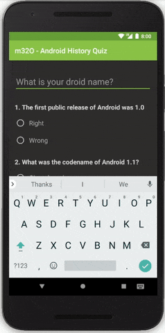

<h1 align="center">m32O</h1>

<strong>Do you really know the Android platform? Challenge your knowledge!</strong>
 Final project of Udacity's Android Basics Nanodegree - Phase 1

 

</img>

<h2>About</h2>
Fourth of eight student projects made in 2017-2018 as part of <a href="https://eu.udacity.com/course/android-basics-nanodegree-by-google--nd803" target="_blank">Udacity's Android Basics Nanodegree</a>.

<h3>☑️ Phase 1 - (Nov. - Feb.):</h3>

1. <a href="https://github.com/r4dixx/LiterallyHelloWorld">Literally Hello World</a>
2. <a href="https://github.com/r4dixx/HelloAndroid" target="_blank">Hello Android</a>
3. <a href="https://github.com/r4dixx/CheesyWinterContest" target="_blank">Cheesy Winter Contest</a>
4. <a href="https://github.com/r4dixx/m32O" target="_blank"><strong>m32O</strong></a>

<h3>☑️ Phase 2 - (Feb. - Jul.):</h3>

1. <a href="https://github.com/r4dixx/RookiePlayer">Rookie Player</a>
2. <a href="https://github.com/r4dixx/VisitCalgary">Visit Calgary</a>
3. <a href="https://github.com/r4dixx/TheGuardianView">The Guardian View</a>
4. <a href="https://github.com/r4dixx/Flourish-And-Blotts-Book-Registry">Flourish & Blotts - Book Registry</a>

<h2>Goal and requirements</h2>

Design and implement an educational quiz app. 

Project must have 4-10 questions. Code wise, requirements include XML formatting, Java interactivity through button clicks, if/else statements and toast messages. Padding/margin is used appropriately such that views are not crammed against each other. Use a nested ViewGroup if applicable. Rotation support is a must.

All variables, methods, and resource IDs must be named appropriately. Also, code should be properly formatted and documented.

<h2>Key learnings</h2>

- `android:imeOptions` & `android:inputType` to manage keyboard's behavior
- `android:configChanges` for rotation support
- Replace a button by another onClick
- Force keyboard appearance in Java
- Smoother scroll to top with `ObjectAnimator`
- styles.xml

<h2>Installation</h2>

1. Download this project as zip and extract it
2. Import it in Android Studio
3. Sync Gradle and run on your device/emulator

Or use <a href="https://github.com/cesarferreira/dryrun" target="_blank">`dryrun`</a> by <a href="https://github.com/cesarferreira" target="_blank">@CesarFerreira</a>

<h2>Contributing</h2>

This project is open to code improvements.

<h2>Project status</h2>
Open to code improvements only. Closed for anything else.

<h2>Credits</h2>

- Author: <a href="https://twitter.com/r4dixx" target="_blank">Amaël Sikel</a>
- Icon slightly modified from <a href="https://openclipart.org/detail/275692/icon-book" target="_blank">luny's work</a>
- Colors from <a href="https://material.io/guidelines/style/color.html#color-color-palette" target="_blank">the official Material palette</a>
- Kudos to my dear wife who tested it for me a gazillion times!

<h2>Copyright</h2>
This project is licensed under the terms of the MIT license and protected by Udacity Honor Code and Community Code of Conduct. See <a href="LICENSE.md">license</a> and <a href="LICENSE.DISCLAIMER.md">disclaimer</a>.
